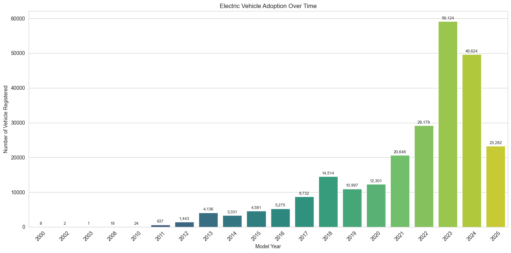
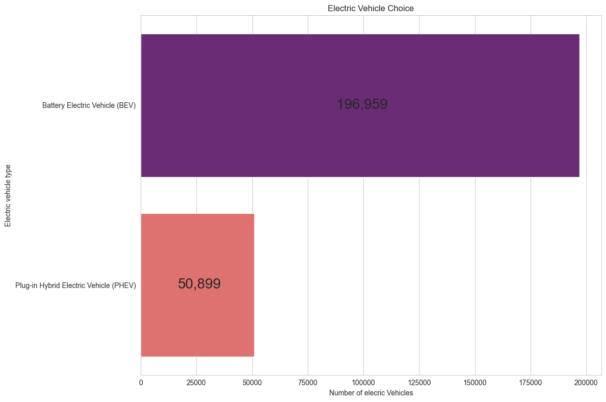
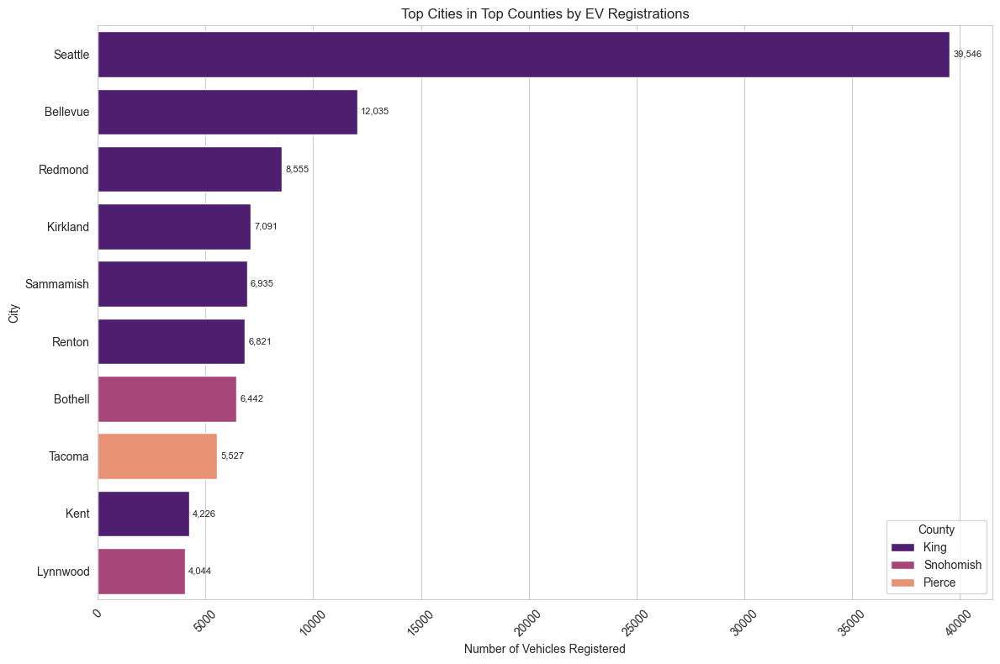
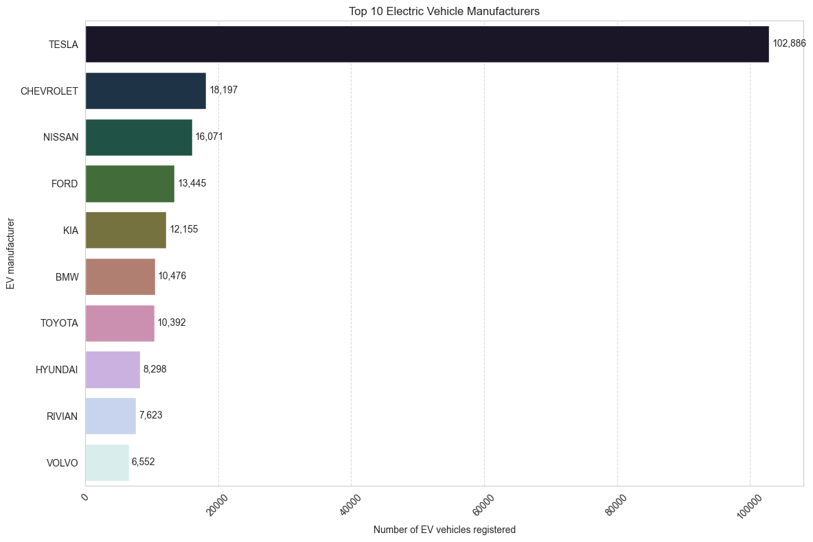

# ELECTRIC VEHICLES: A MARKET SIZE EXPLORATION

## Project Overview:
This project explores the growth and current state electric vehicle (EV) market using data-driven analysis.
It examines trends, vehicle characteristics, geographical patterns and market potential to provide insights into the adoption and distribution of EVs.

## Objectives
The main goals od this project are:
- Analyze **EV adoption over time** to identify growth patterns.
- Study the **geogrphical distribution** of EVs across cities.
- Categorize the **EV types** and compare their prevalence.
- Evaluate **make and model popularity** in the EV market.
- Conduct an **electric range analysis** to assess performance.
Estimate the **current and potential market size**.

## Key Metrics Analyzed

|   Metric                                    |   Desription  |
|---------------------------------------------|---------------|
| **EV Adoption Over Time**                   | Annual trends in EV registrations and sales. |
| **Geographical Distribution**               | Showing adoption rates by county. |
| **EV Type**                                 | Breakdown of market share by EV types. |
| **Make and Model Popularity**               | Ranking of top selling EV models. |
| **Electric Range Analysis**                 | comparative analysis of vehicle ranges. |
| **Market Size Estimation**                  | Current size and projected growth. |

## Sample Visualizations

**EV Adoption Over Time**

**EV Type**

**Top Cities**

**Popular make and Model**

## Tools
- **Python:** Pandas, Numpy, Matplotlib, Seaborn
- **IDE:** VS Code
- **Data Format:** CSV

## Result and Insights

**Adoption Trends**
- Significant growth in EV registrations from 2011 - 2023.
- Sharp increase post-2020 whmight be attributed to policy incentives.
- Sharp decline in EV registration between 2023 and 2024.

**Geographical Insights**
- King, Snohomish, and Pierce counties are the top 3 counties
- Seattle city has the highest number of registrered EV followed by Bellevue and Redmond respectively taking the 2nd and 3rd ranking
- the top 3 cities are all located in the King county.

**Electric Vehicle Type**
- 2 types of EV were identified from this data
- Battery Electric Vehicle and Plug-in Hybrid Electric
- Users prefer the Battery EV than Plug-in Hybrid EV

**Popular Manufacturers**
- TESLA dominates the EV manufacturers
- CHEVROLET ranked 2nd closely follwed by NISSAN at the 3rd position

**Popular Model**
- TESLA Models (Y, and 3) dominates the EV space
- NISSAN LEAF is the 3rd most popular EV

